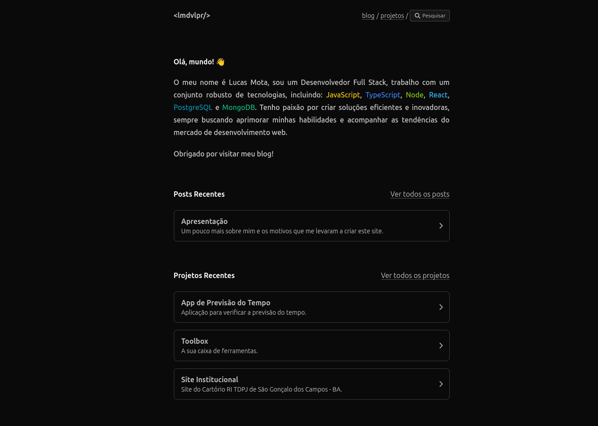

<h1 align="center"> 👋 &lt;lmdvlpr/&gt; </h1>

  Este é o repositório do meu site pessoal que foi desenvolvido usando como base o template <a href="https://github.com/trevortylerlee/astro-micro" target="_blank">Astro Micro</a>

  <a href="#-tecnologias">Tecnologias</a>&nbsp;&nbsp;&nbsp;|&nbsp;&nbsp;&nbsp;
  <a href="#-projeto">Projeto</a>

 

  

## 🚀 Tecnologias

O site foi desenvolvido com as seguintes tecnologias:

- Astro
- TypeScript
- Tailwind CSS
- MDX

## 💻 Projeto

O que me motivou a criar este site foi a necessidade de manter um portfólio online e a oportunidade de escrever um blog para compartilhar ideias, descobertas e conteúdos técnicos.

